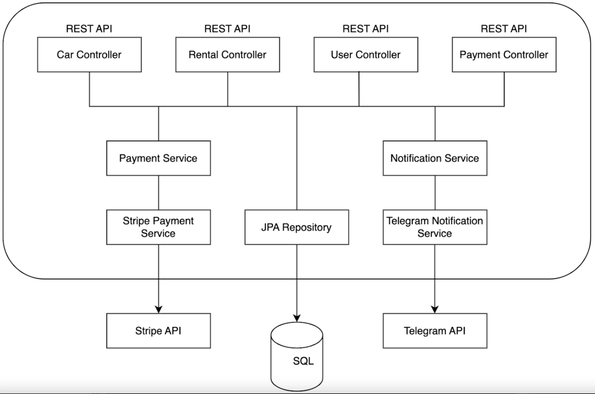

# Car Sharing Service

## Introduction

Welcome to the **Car Sharing Service** project! This project addresses the challenges faced by a traditional car sharing service that currently relies on manual processes and paper records. The new system is designed to streamline operations, enhance the user experience, and provide modern payment options.

## Technologies and Tools Used

This project leverages a robust set of technologies and frameworks, including:

- **Java 17**
- **Spring Boot** – Core framework for the application.
- **Spring Security** – Handles authentication and authorization.
- **Spring Data JPA** – Manages data persistence with a database.
- **Spring Validation** – Validates user input with custom annotations.
- **JWT (JSON Web Tokens)** – Ensures secure user authentication.
- **Stripe** – Facilitates online payments.
- **Telegram API** – Sends notifications to administrators.
- **Docker** – Containerizes the application for easy deployment.
- **Scheduled Tasks** – Automates tasks like checking for overdue rentals.
- **Swagger** – Provides interactive API documentation.
- **Testcontainers** – Supports integration testing with Docker containers.
- **Global Exception Handling** – Centralized error handling for the application.
- **MapStruct** – Simplifies mapping between DTOs and entities.

These technologies ensure a secure, efficient, and user-friendly car sharing management system.

## Project Functionalities

The Car Sharing Service system provides various features to enhance both user and administrative experiences. It includes functionality for managing users, car inventory, rentals, payments, and notifications. The core controllers for each feature allow users and administrators to interact with the system seamlessly.

### User Management
Users can register, log in, and manage their profiles. The authentication is secured using JWT tokens, and the profile information can be updated via the `UsersController`. The system also allows administrators to modify user roles through the same controller.

### Car Inventory Management
The `CarController` allows administrators to manage the car inventory, including adding new cars, updating car details, and deleting cars. The system ensures that car availability is updated accordingly, with inventory levels reflecting current stock, including after rentals. Additionally, all users, including unregistered ones, can view the list of available cars. Access to managing cars (adding, updating, and deleting) is restricted to users with the appropriate managerial role.

### Rental Management
The `RentalController` handles the rental process, enabling users to create new rentals, track their active or past rentals, and return rented cars. When a rental is created, the car inventory is automatically updated. Users can also return rentals, which updates both the rental status and the car inventory. Administrators can manage and monitor all rentals, including tracking overdue rentals and viewing detailed rental information. The system ensures that both users and administrators have appropriate access based on roles and rental statuses.

### Payment Processing
Payments are processed using the `PaymentsController`, which integrates with the Stripe API. Users can pay for rentals online, and the system handles payment creation and success/cancel callbacks. Administrators can manage payment information, while users can view their payment history. The system also supports overdue fines via Stripe, ensuring accurate billing for late returns.

### Notifications
The system integrates with the Telegram API to send notifications to specific users regarding new rentals, successful or canceled payments, and overdue rentals. Notifications are sent through the `NotificationsService`, which ensures that users are informed about their rental status, payment outcomes, and overdue charges. Additionally, the service sends notifications to all administrators in a Telegram bot about each overdue rental. The system also checks daily for overdue rentals, notifying administrators accordingly. This allows for timely updates on rental statuses and payment changes.

## Project Architecture

Below is a diagram representing the architecture of the Car Sharing Service application, which highlights the main components and their interactions:



The diagram shows how different modules interact with each other, such as user management, rental processing, payment handling, and notifications.


## Project Setup

### Requirements

Before setting up the project, ensure you have the following dependencies:

- **Docker** 
- **Stripe account**: For payment processing integration.
- **Telegram Bot Token**: For sending notifications via Telegram.

### Setup Steps

1. Ensure that **Docker** is running on your machine.
2. Clone the project from GitHub:
   ```
   git clone https://github.com/BohdanZorii/car-sharing-service.git
   ```
3. Navigate to the project directory:
   ```
   cd car-sharing-service
   ```
4. Create a `.env` file based on the provided `env.template`, copy the contents of `env.template` to a new file named `.env` and update the `.env` file with your specific configuration, such as database credentials, Telegram bot token, etc.


5. Build and start the containers using Docker Compose:
   ```
   docker-compose up --build
   ```
   This command will build the Docker images and start the containers for both application and database.


6. The application should now be running, you can test it using **Swagger**!

### Testing
After starting the application, you can explore and test the API endpoints using Swagger. It offers an interactive interface to view and test the available endpoints directly from your browser.

- **[Access Swagger Documentation](http://localhost:8080/api/swagger-ui/index.html)**


## Challenges & Solutions

During the development of the Car Sharing Service project, several challenges were encountered. These challenges were addressed through tailored solutions, ensuring the system’s functionality, security, and user-friendliness.

### Secure Authentication and Role Management
Implementing secure authentication while allowing role-based access was a primary challenge. To solve this, JWT-based authentication was integrated with Spring Security. This approach ensured secure token management and allowed fine-grained role-based access control for users and administrators.

### Real-time Notifications
Delivering timely notifications to users and administrators, particularly for overdue rentals, required integrating with an external messaging service. The Telegram API was utilized to send notifications efficiently. Scheduled tasks were implemented to automate daily checks for overdue rentals, ensuring administrators stayed informed in real-time.

### Payment Integration and Management
Integrating payment processing with Stripe required handling payment creation, success, and cancellation callbacks. The PaymentsController was designed to manage this process seamlessly while ensuring secure transactions. Overdue fines were automated to streamline billing for late returns.

### Scheduled Tasks for Automation
Automating repetitive tasks, such as checking for overdue rentals, was essential. Scheduled tasks were implemented to run automatically, ensuring overdue rentals were flagged daily and administrators were notified promptly.

### Reliable Testing Environments
To simulate production-like database conditions during testing, Testcontainers was used. It allowed the creation of isolated database environments for integration tests, ensuring consistent and accurate testing results.

### Containerized Deployment
Deploying the system across different environments while maintaining consistency posed challenges. Docker was used to containerize the application, ensuring portability and ease of deployment in diverse environments.

Thanks to the careful planning and execution of solutions, the Car Sharing Service application is now a reliable, secure, and seamless experience for both users and administrators. Each challenge was overcome in a way that enhanced the overall usability and performance of the system.


